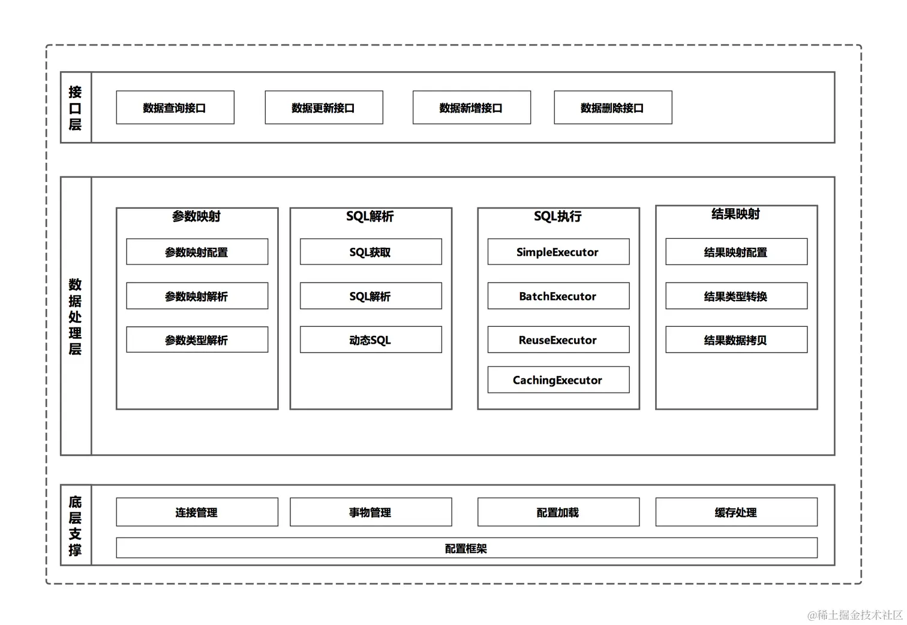

## 使用 Spring Initializr 初始化一个 Spring Boot 项目

Spring Initializr 页面中的配置项需要开发者逐一进行设置，过程非常简单，根据项目情况依次填写即可。

本次演示中，开发语言选择 Java，Project 项目类型选项中勾选 Maven Project，因为本地安装的项目管理工具是 Maven。Spring Boot 版本选择为 2.3.7，当然也可以选择其他稳定版本，根据实际开发的情况去选择即可，即使这里已经选择一个版本号，在初始化成功后也能够在项目中的 pom.xml 文件或者 build.gradle 文件中修改 Spring Boot 版本号。

项目基础信息中，Group 输入框中填写“ltd.newbee.mall”，Artifact 输入框中填写“newbee-mall”，Name 输入框中填写“newbee-mall”，Description 输入框中填写“NEWBEE商城”，Package name 输入框中填写“ltd.newbee.mall”，Packaging 打包方式选择 Jar，JDK 版本选择 8。

由于即将开发的是一个 Web 项目，因此需要添加 web-starter 依赖，点击 Dependencies 右侧的“ADD DEPENDENCIES”按钮，在弹出的弹框中输入关键字“web”并选择“Spring Web：Build web, including RESTful, applications using Spring MVC. Uses Apache Tomcat as the default embedded container.”选项。

## Maven插件启动
项目初始化时，配置项中选择的项目类型为 Maven Project，pom.xml 文件中会默认引入 spring-boot-maven-plugin 插件依赖，因此可以直接使用 Maven 命令来启动 Spring Boot 项目，插件配置如下：

[//]: # (<build>)

[//]: # (    <plugins>)

[//]: # (        <plugin>)

[//]: # (            <groupId>org.springframework.boot</groupId>)

[//]: # (            <artifactId>spring-boot-maven-plugin</artifactId>)

[//]: # (        </plugin>)

[//]: # (    </plugins>)

[//]: # (</build>)
如果 pom.xml 文件中没有该 Maven 插件配置，是无法通过这种方式启动Spring Boot 项目的，这一点需要注意。

Maven插件启动 Spring Boot 项目的步骤如下：

首先点击下方工具栏中的 Terminal 打开命令行窗口，之后在命令行中输入命令 mvn spring-boot:run并执行该命令，即可启动 Spring Boot 项目，效果与之前介绍的启动方式一样。

## a personal project for learning springboot by my self
Project：表示将要初始化的 Spring Boot 项目类型，可以选择 Maven 构建或者 Gradle 构建，本项目将选择常用的 Maven 方式。
Language：表示编程语言的选择，支持 Java 、Kotlin 和 Groovy。
Spring Boot：表示将要初始化的 Spring Boot 项目所使用的 Spring Boot 版本，由于更新迭代较快，Spring Initializr 页面中会展示最新的几个 Spring Boot 版本号，之前的版本号虽然不会在这里展示，但是依然可以正常使用。
Project Metada：表示项目的基础设置，包括项目包名的设置、打包方式、JDK 版本选择等等。
Group：即 GroupID，表示项目组织的标识符，实际对应 Java 的包结构，是 main 目录里 Java 的目录结构。
Artifact：即 ArtifactId，表示项目的标识符，实际对应项目的名称，也就是项目根目录的名称。
Description：表示项目描述信息。
Package name：表示项目包名。
Packaging：表示项目的打包方式，有两种选择：Jar 和 War，在 Spring Boot 项目初始化时，如果选用的方式不同，那么导入的打包插件也有区别。
Java：表示 JDK 版本的选择，有 15、11 和 8 三个版本供开发者选择。
Dependencies：表示将要初始化的 Spring Boot 项目所需的依赖和 starter，如果不选择的话默认生成的项目中仅有核心模块 spring-boot-starter 和测试模块 spring-boot-starter-test。在这个配置项中可以设置项目中所需的 starter，比如 Web 开发所需的依赖，数据库开发所需的依赖等等。

## MVC 自动配置内容

文档地址为 [https://docs.spring.io/spring-boot/docs/2.3.7.RELEASE/reference/htmlsingle/#boot-features-spring-mvc-auto-configuration]

## MyBatis 

封装了 JDBC 大部分操作，减少开发人员工作量；
相比一些自动化的 ORM 框架，“半自动化”使得开发人员可以自由的编写 SQL 语句，灵活度更高；
Java 代码与 SQL 语句分离，降低维护难度；
自动映射结果集，减少重复的编码工作；
开源社区十分活跃，文档齐全，学习成本不高。

